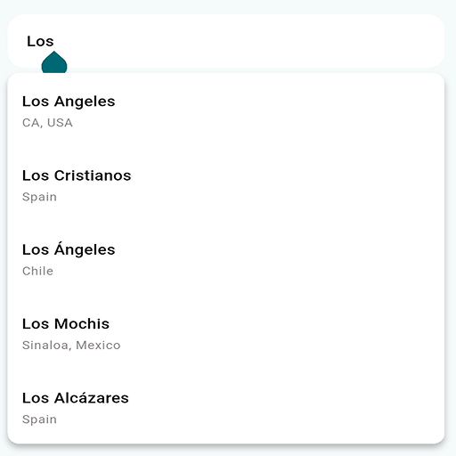

# Google Places Search Field

A customizable, map-agnostic Flutter widget for searching locations using Google Places Autocomplete.

**Version 2.0.0 is a complete rewrite** that drops all heavy native SDKs in favor of a 100% pure Dart implementation. It includes built-in **Session Tokens** to drastically reduce your Google Cloud billing, and it now supports every single Flutter platform (including Web and Desktop) out of the box.

## Features

- **Cost-Optimized (Session Tokens):** Automatically manages UUID v4 session tokens to group autocomplete keystrokes into a single billing event, cutting Google API costs by up to 90%.
- **Map-Agnostic:** Returns a custom `PlaceLatLng` object, meaning you can use it seamlessly with `google_maps_flutter`, `flutter_map` (latlong2), or any other map renderer.
- **100% Pure Dart:** Zero native dependencies or platform channels. No more build errors or sandbox restrictions.
- **Fully Testable:** Supports Dependency Injection via an optional `http.Client` parameter, allowing you to easily write automated widget/integration tests using mock network responses.
- **Highly Customizable:** Easily override the input decoration, text styles, and hint text to match your app's theme.

## Platform Support

Because this package relies purely on Dart HTTP calls, it works flawlessly everywhere.

| Platform | Supported |
| -------- | --------- |
| Android  | ✅ Yes    |
| iOS      | ✅ Yes    |
| Web      | ✅ Yes    |
| macOS    | ✅ Yes    |
| Windows  | ✅ Yes    |
| Linux    | ✅ Yes    |

## Getting Started

### Prerequisites

1. Enable the **Places API** in your Google Cloud Console.
2. Generate an API key.

### Installation

Add the package to your `pubspec.yaml`:

```yaml
dependencies:
  google_places_search_field: ^2.0.0
```

- Note: You no longer need to install flutter_google_places_sdk or google_maps_flutter to use this package!

## Usage

```dart
import 'package:flutter/material.dart';
import 'package:google_places_search_field/google_places_search_field.dart';
import 'package:google_places_search_field/models/place_latlng.dart';

// ... inside your widget

GooglePlacesSearchField(
  apiKey: 'YOUR_GOOGLE_API_KEY',
  hintText: 'Search for a beach, cafe, or city...',
  onLatLngSelected: (PlaceLatLng coords) {
    print('Selected location: ${coords.latitude},${coords.longitude}');

    // If using google_maps_flutter:
    // final mapPoint = maps.LatLng(coords.latitude, coords.longitude);

    // If using flutter_map:
    // final openPoint = latlong2.LatLng(coords.latitude, coords.longitude);
  },
);
```

## Testing

To write automated tests for screens implementing this widget without hitting the real Google API, inject a mock HTTP client:

```dart
import 'package:http/testing.dart';

final mockClient = MockClient((request) async {
  // Return your fake Google JSON responses here
});

GooglePlacesSearchField(
  apiKey: 'TEST_KEY',
  httpClient: mockClient, // <--- Bypasses real network calls
  onLatLngSelected: (coords) {},
)
```

## Preview



## Contributing

Contributions are welcome! Feel free to open issues or submit pull requests on the [Github Repository](https://github.com/iampranavk/google-places-search-field)
